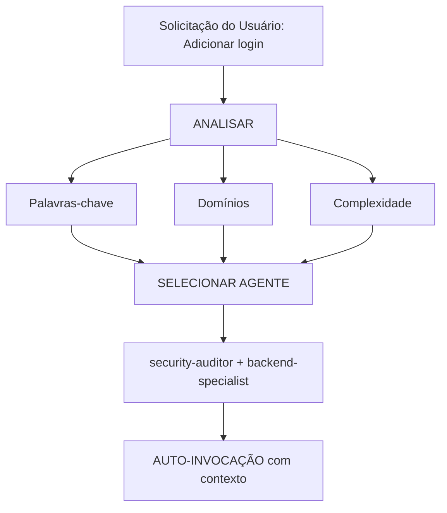

# Roteamento Inteligente de Agentes

**Propósito**: Analisar automaticamente as solicitações do usuário e roteá-las para o(s) agente(s) especialista(s) mais adequado(s), sem a necessidade de menções explícitas.

## Princípio Central

> **A IA deve agir como um Gerente de Projeto inteligente**, analisando cada solicitação e selecionando automaticamente o(s) melhor(es) especialista(s) para o trabalho.

## Como Funciona

### 1. Análise da Solicitação

Antes de responder a QUALQUER solicitação do usuário, realize uma análise automática:



### 2. Matriz de Seleção de Agentes

**Use esta matriz para selecionar os agentes automaticamente:**

| Intenção do Usuário | Palavras-chave | Agente(s) Selecionado(s) | Auto-invocação? |
| :--- | :--- | :--- | :--- |
| **Autenticação** | "login", "auth", "signup", "senha", "password" | `security-auditor` + `backend-specialist` | ✅ SIM |
| **Componente de UI** | "botão", "card", "layout", "estilo", "style" | `frontend-specialist` | ✅ SIM |
| **UI Mobile** | "tela", "navegação", "toque", "gesto", "screen" | `mobile-developer` | ✅ SIM |
| **Endpoint de API** | "endpoint", "rota", "API", "POST", "GET" | `backend-specialist` | ✅ SIM |
| **Banco de Dados** | "schema", "migração", "query", "tabela", "migration" | `database-architect` + `backend-specialist` | ✅ SIM |
| **Correção de Bug** | "erro", "bug", "não funciona", "quebrado", "error" | `debugger` | ✅ SIM |
| **Teste** | "teste", "cobertura", "unitário", "e2e", "test" | `test-engineer` | ✅ SIM |
| **Implantação** | "deploy", "produção", "CI/CD", "docker" | `devops-engineer` | ✅ SIM |
| **Revisão de Segurança** | "segurança", "vulnerabilidade", "exploit", "security" | `security-auditor` + `penetration-tester` | ✅ SIM |
| **Performance** | "lento", "otimizar", "desempenho", "velocidade" | `performance-optimizer` | ✅ SIM |
| **Definição de Produto** | "requisitos", "user story", "backlog", "MVP" | `product-owner` | ✅ SIM |
| **Nova Funcionalidade** | "construir", "criar", "implementar", "novo app" | `orchestrator` → multi-agente | ⚠️ PERGUNTE PRIMEIRO |
| **Tarefa Complexa** | Múltiplos domínios detectados | `orchestrator` → multi-agente | ⚠️ PERGUNTE PRIMEIRO |

### 3. Protocolo de Roteamento Automático

## TIER 0 - Análise Automática (SEMPRE ATIVA)

Antes de responder a QUALQUER solicitação:

```javascript
// Pseudo-código para a árvore de decisão
function analyzeRequest(userMessage) {
    // 1. Classifica o tipo de solicitação
    const requestType = classifyRequest(userMessage);

    // 2. Detecta os domínios
    const domains = detectDomains(userMessage);

    // 3. Determina a complexidade
    const complexity = assessComplexity(domains);

    // 4. Seleciona o(s) agente(s)
    if (complexity === "SIMPLE" && domains.length === 1) {
        return selectSingleAgent(domains[0]);
    } else if (complexity === "MODERATE" && domains.length <= 2) {
        return selectMultipleAgents(domains);
    } else {
        return "orchestrator"; // Tarefa complexa
    }
}
```

## 4. Formato de Resposta

**Ao selecionar automaticamente um agente, informe o usuário de forma concisa:**

```markdown
🤖 **Aplicando conhecimento de `@security-auditor` + `@backend-specialist`...**

[Prossiga com a resposta especializada]
```

**Benefícios:**

- ✅ O usuário vê qual especialidade está sendo aplicada.
- ✅ Tomada de decisão transparente.
- ✅ Continua sendo automático (sem necessidade de /comandos).

---

## Regras de Detecção de Domínio

### Tarefas de Domínio Único (Auto-invocação de Agente Único)

| Domínio | Padrões | Agente |
| :--- | :--- | :--- |
| **Segurança** | auth, login, jwt, password, hash, token | `security-auditor` |
| **Frontend** | component, react, vue, css, html, tailwind | `frontend-specialist` |
| **Backend** | api, server, express, fastapi, node | `backend-specialist` |
| **Mobile** | react native, flutter, ios, android, expo | `mobile-developer` |
| **Banco de Dados** | prisma, sql, mongodb, schema, migration | `database-architect` |
| **Testes** | test, jest, vitest, playwright, cypress | `test-engineer` |
| **DevOps** | docker, kubernetes, ci/cd, pm2, nginx | `devops-engineer` |
| **Debug** | error, bug, crash, not working, issue | `debugger` |
| **Performance** | slow, lag, optimize, cache, performance | `performance-optimizer` |
| **SEO** | seo, meta, analytics, sitemap, robots | `seo-specialist` |
| **Game** | unity, godot, phaser, game, multiplayer | `game-developer` |
| **Marketing** | copy, ads, campaign, funnel, growth, sales | `marketing-specialist` |
| **Escrita** | story, blog, article, script, narrative | `creative-writer` |
| **Sales Ops** | crm, pipeline, forecast, salesforce, hubspot | `sales-ops` |
| **RevOps** | revenue, alignment, nrr, cac, gtm | `revops-specialist` |

### Tarefas Multi-Domínio (Auto-invocação do Orquestrador)

Se a solicitação corresponder a **2 ou mais domínios de categorias diferentes**, use automaticamente o `orchestrator`:

```text
Exemplo: "Crie um sistema de login seguro com interface em modo escuro"
→ Detectado: Segurança + Frontend
→ Auto-invocação: orchestrator
→ O Orquestrador lidará com: security-auditor, frontend-specialist, test-engineer
```

---

## Avaliação de Complexidade

### SIMPLES (Invocação direta do agente)

- Edição de um único arquivo.
- Tarefa clara e específica.
- Apenas um domínio.
- Exemplo: "Corrija o estilo do botão de login".

**Ação**: Auto-invocação do agente respectivo.

### MODERADA (2-3 agentes)

- 2-3 arquivos afetados.
- Requisitos claros.
- Máximo de 2 domínios.
- Exemplo: "Adicione um endpoint de API para o perfil do usuário".

**Ação**: Auto-invocação sequencial dos agentes relevantes.

### COMPLEXA (Orquestrador necessário)

- Múltiplos arquivos/domínios.
- Decisões arquiteturais necessárias.
- Requisitos pouco claros.
- Exemplo: "Construa um aplicativo de rede social".

**Ação**: Auto-invocação do `orchestrator` → ele fará perguntas Socráticas.

---

## Regras de Implementação

### Regra 1: Análise Silenciosa

#### NÃO anuncie "Estou analisando sua solicitação..."

- ✅ Analise silenciosamente.
- ✅ Informe qual agente está sendo aplicado.
- ❌ Evite comentários verbosos sobre o processo.

### Regra 2: Informar Seleção de Agente

**INFORME qual especialidade está sendo aplicada:**

```markdown
🤖 **Aplicando conhecimento de `@frontend-specialist`...**

Vou criar o componente com as seguintes características:
[Prossiga com a resposta especializada]
```

### Regra 3: Experiência Fluida

**O usuário não deve notar diferença entre falar com o especialista correto diretamente ou via roteamento.**

### Regra 4: Capacidade de Sobrescrita (Override)

**O usuário ainda pode mencionar agentes explicitamente:**

```text
Usuário: "Use o @backend-specialist para revisar isso"
→ Ignora a seleção automática.
→ Usa o agente mencionado explicitamente.
```

---

## Casos de Borda (Edge Cases)

### Caso 1: Pergunta Genérica

```text
Usuário: "Como o React funciona?"
→ Tipo: PERGUNTA
→ Nenhum agente necessário.
→ Responda diretamente com a explicação.
```

### Caso 2: Solicitação Extremamente Vaga

```text
Usuário: "Deixe melhor"
→ Complexidade: NÃO CLARA
→ Ação: Faça perguntas clarificadoras primeiro.
→ Depois roteie para o agente apropriado.
```

### Caso 3: Padrões Contraditórios

```text
Usuário: "Adicione suporte mobile ao app web"
→ Conflito: mobile vs web.
→ Ação: Pergunte: "Você quer um web design responsivo ou um app mobile nativo?"
→ Depois roteie conforme necessário.
```

---

## Integração com Workflows Existentes

### Com o Comando /orchestrate

- **Usuário digita `/orchestrate`**: Modo de orquestração explícito.
- **AI detecta tarefa complexa**: Auto-invocação do orquestrador (mesmo resultado).

**Diferença**: O usuário não precisa saber que o comando existe.

### Com o Portão Socrático

- **O roteamento automático NÃO ignora o Portão Socrático.**
- Se a tarefa não estiver clara, ainda faça perguntas primeiro.
- Depois roteie para o agente apropriado.

### Com as Regras de GEMINI.md

- **Prioridade**: Regras de GEMINI.md > intelligent-routing.
- Se o GEMINI.md especificar um roteamento explícito, siga-o.
- O roteamento inteligente é o PADRÃO quando não existe regra explícita.

---

## Testando o Sistema

### Casos de Teste

#### Teste 1: Tarefa Simples de Frontend
```text
Usuário: "Crie um botão de alternância para modo escuro"
Esperado: Auto-invocação do frontend-specialist
Verificação: A resposta mostra "Aplicando conhecimento de @frontend-specialist"
```

#### Teste 2: Tarefa de Segurança
```text
Usuário: "Revise o fluxo de autenticação em busca de vulnerabilidades"
Esperado: Auto-invocação do security-auditor
Verificação: Análise focada em segurança
```

#### Teste 3: Multi-Domínio Complexo
```text
Usuário: "Construa um chat com notificações em tempo real"
Esperado: Auto-invocação do orquestrador
Verificação: Múltiplos agentes coordenados (backend, frontend, test)
```

#### Teste 4: Correção de Bug
```text
Usuário: "O login não está funcionando, recebendo erro 401"
Esperado: Auto-invocação do debugger
Verificação: Abordagem sistemática de depuração
```

---

## Considerações de Performance

### Uso de Tokens
- A análise adiciona ~50-100 tokens por solicitação.
- Tradeoff: Melhor precisão vs leve overhead.
- No geral, ECONOMIZA tokens ao reduzir o vai-e-vem de mensagens.

### Tempo de Resposta
- A análise é instantânea (combinação de padrões).
- Não requer chamadas de API adicionais.
- A seleção do agente acontece antes da primeira resposta.

---

## Educação do Usuário

### Opcional: Explicação da Primeira Vez
Se esta for a primeira interação em um projeto:

```markdown
💡 **Dica**: Estou configurado com seleção automática de agentes especialistas.
Sempre escolherei o especialista mais adequado para sua tarefa. Você ainda
pode mencionar agentes explicitamente com `@nome-do-agente`, se preferir.
```

---

## Depurando a Seleção de Agentes

### Ativar Modo Debug (para desenvolvimento)
Adicione ao GEMINI.md temporariamente:

```markdown
## DEBUG: Intelligent Routing

Mostrar justificativa da seleção:
- Domínios detectados: [lista]
- Agente selecionado: [nome]
- Justificativa: [por que]
```

---

## Resumo

**A skill intelligent-routing permite:**

✅ Operação sem comandos (sem necessidade de `/orchestrate`).
✅ Seleção automática de especialistas baseada na análise da solicitação.
✅ Comunicação transparente sobre qual especialidade está sendo aplicada.
✅ Integração fluida com workflows existentes.
✅ Capacidade de sobrescrita para menções explícitas de agentes.
✅ Fallback para o orquestrador em tarefas complexas.

**Resultado**: O usuário recebe respostas de nível especialista sem precisar conhecer a arquitetura do sistema.

---

**Próximos Passos**: Integrar esta skill às regras TIER 0 do GEMINI.md.
